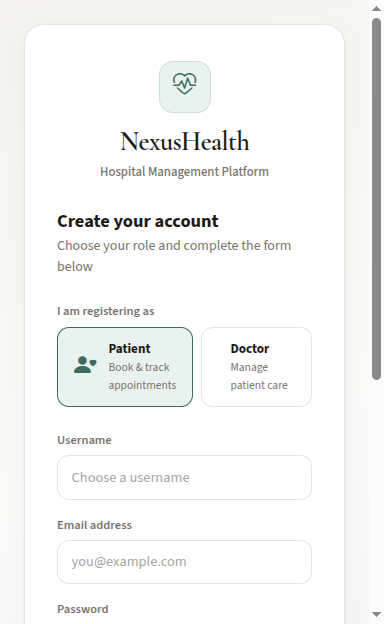

# Hospital Blood Report Analyzer

<p align="center">
  <strong>Nexus Health</strong> — AI-assisted blood report workflows, appointments, and role-based hospital portals on Django 6.
</p>

<p align="center">
  <a href="https://www.djangoproject.com/"></a>
  <a href="https://www.python.org/"></a>
  <a href="https://www.postgresql.org/"></a>
  <a href="https://github.com/cdasadiya/ai-hackathon-sept-2026/actions"></a>
  
  
</p>

<p align="center">
  <a href="https://github.com/cdasadiya/ai-hackathon-sept-2026">Repository</a> ·
  <a href="#quick-start">Quick start</a> ·
  <a href="#stack--migration-matrix">Stack matrix</a> ·
  <a href="#api-overview">API</a> ·
  <a href="#live-demo">Live demo</a> ·
  <a href="#deployment">Deploy</a> ·
  <a href="#user-guide">User guide</a>
</p>

---

## Live demo

**Production (Render):** [https://ai-hackathon-sept-2026.onrender.com/](https://ai-hackathon-sept-2026.onrender.com/)

| Check | URL |
| --- | --- |
| Health | `/healthz/` |
| Register | `/register/` |
| Sign in | `/login/` |

After deploy, verify static assets and routes:

```bash
./scripts/render_smoke.sh
./scripts/production_url_audit.sh
```

---

## Overview

Production-oriented Django application for hospitals and hackathon demos: **patients** book visits and upload labs, **doctors** review appointments and reports, **admins** approve providers and configure **Google Drive** and **n8n** automation. A REST API with **JWT** supports integrations and mobile clients.

| Role | Capabilities |
| --- | --- |
| **Patient** | Register, book appointments, upload PDF/image reports, view AI summaries |
| **Doctor** | Manage schedule, update appointment status, clinical remarks, report review |
| **Admin** | Doctor verification, dashboards, integration secrets, API tokens |

---

## Highlights

- Custom **User** model with `ADMIN` / `DOCTOR` / `PATIENT` roles  
- **Anti–double-booking** and 30-minute minimum lead time on appointments  
- Human-readable IDs (`APT-YYYY-NNNNNN`)  
- Blood reports: local media + optional **Drive v3** upload  
- **n8n** webhook on upload; callback updates `HealthReport` and `ai_analysis`  
- **DRF** viewsets, **simplejwt**, session auth for browser UI  
- **WhiteNoise** + **Gunicorn 26** for production  
- **36 automated tests**, **pip-audit** clean, **Docker** + **GitHub Actions**

---

## Stack

| Layer | Technology | Version |
| --- | --- | --- |
| Runtime | Python | 3.14.7 |
| Framework | Django | 6.1.1 |
| API | Django REST Framework | 3.18.1 |
| Auth | djangorestframework-simplejwt | 5.5.1 |
| Database | PostgreSQL | 18.x |
| Server | Gunicorn | 26.2.0 |
| Static files | WhiteNoise | 6.12.0 |
| Integrations | google-api-python-client, requests | 2.200.0 / 2.34.2 |

Frontend assets load from CDN: **Bootstrap 5.3.8**, **Bootstrap Icons 1.13.1**, **Font Awesome 7.3.1**.

---

## Stack & migration matrix

Before, target, and after versions live in one place:

**[STACK_VERSION_AUDIT.md](STACK_VERSION_AUDIT.md)** — unified migration matrix (baseline `ac092e9` → current release targets → installed pins).

Additional engineering records:

| Document | Description |
| --- | --- |
| [MIGRATION_REPORT.md](MIGRATION_REPORT.md) | Final migration summary |
| [MIGRATION_PLAN.md](MIGRATION_PLAN.md) | Original plan |
| [FEATURE_INVENTORY.md](FEATURE_INVENTORY.md) | Features and routes |
| [FEATURE_TEST_REPORT.md](FEATURE_TEST_REPORT.md) | Test evidence |

---

## Architecture

```text
 Browser / API clients
         │
         ▼
┌─────────────────────────────┐
│  Django 6 + DRF + JWT       │
│  Roles · Appointments ·     │
│  Reports · Admin            │
└─────┬───────────┬───────────┘
      │           │
      ▼           ▼
 PostgreSQL   Google Drive + n8n
```

---

## Quick start

### Prerequisites

- Python **3.14.7**
- PostgreSQL **18+** (recommended) or SQLite for quick dev
- Git

### Local setup

```bash
git clone https://github.com/cdasadiya/ai-hackathon-sept-2026.git
cd ai-hackathon-sept-2026

python3.14 -m venv venv
source venv/bin/activate

pip install --upgrade pip
pip install -r requirements.txt

cp .env.example .env
# Edit SECRET_KEY and DATABASE_URL as needed

python manage.py migrate
python manage.py seed_demo_users   # optional demo accounts
python manage.py runserver
```

Open **http://127.0.0.1:8000/**.

Demo users are created by `seed_demo_users` (see command output for usernames; default password is set in that command).

### Docker (PostgreSQL 18 + Gunicorn)

```bash
docker compose up --build
```

App: **http://localhost:8000**

### Developer tooling

```bash
pip install -r requirements-dev.txt
python manage.py test app
pip-audit -r requirements.txt
```

CI runs the same checks on push/PR to `main` (see `.github/workflows/ci.yml`).

### Testing

```bash
python manage.py test app
python manage.py check --deploy   # with production-like env vars
./scripts/production_url_audit.sh # read-only checks against live Render
```

---

## Configuration

Copy `.env.example` to `.env`. Important variables:

| Variable | Purpose |
| --- | --- |
| `SECRET_KEY` | Django secret (required in production) |
| `DEBUG` | `True` locally, `False` on Render |
| `DATABASE_URL` | Postgres connection string |
| `REQUIRE_POSTGRES` | `True` on Render |
| `ALLOWED_HOSTS` / `CSRF_TRUSTED_ORIGINS` | Host and CSRF allow lists |
| `HEALTHZ_RUN_MIGRATIONS` | Default `false`; avoid migrate on every health probe |
| `SEED_DEMO_USERS` | Control demo seed in `build.sh` |

**Integration secrets** (Google service account JSON, n8n URLs, callback token) are stored in Django Admin → **Integration Configuration**, not in `.env`.

---

## API overview

| Method | Path | Description |
| --- | --- | --- |
| POST | `/api/token/` | Obtain JWT access + refresh |
| POST | `/api/token/refresh/` | Refresh access token |
| POST | `/api/register/` | Register user (not ADMIN) |
| CRUD | `/api/appointments/` | Role-scoped appointments |
| POST | `/api/appointments/{id}/update_status/` | Doctor/admin status update |
| CRUD | `/api/reports/` | Blood reports |
| POST | `/api/n8n/health-report-callback/` | n8n callback (Bearer token) |

Example token request:

```bash
curl -X POST http://127.0.0.1:8000/api/token/ \
  -H "Content-Type: application/json" \
  -d '{"username":"patient1","password":"Pass1234!"}'
```

Web routes include `/login/`, `/register/`, `/patient/dashboard/`, `/doctor/dashboard/`, `/dashboard/admin/`, and `/admin/`.

---

## Project structure

```text
ai-hackathon-sept-2026/
├── app/                 # Models, views, API, services, tests
├── config/              # settings, urls, wsgi
├── templates/           # Bootstrap UI
├── .github/workflows/   # CI
├── Dockerfile
├── docker-compose.yml
├── render.yaml          # Render blueprint
├── build.sh             # Render build
├── requirements.txt
├── requirements-dev.txt
└── STACK_VERSION_AUDIT.md
```

---

## Deployment

### Render (recommended)

1. Connect [github.com/cdasadiya/ai-hackathon-sept-2026](https://github.com/cdasadiya/ai-hackathon-sept-2026).  
2. **Python 3.14.7**, linked **PostgreSQL**, branch **`main`**.  
3. **Build command:** `./build.sh` (installs deps, `collectstatic`, migrate when `DATABASE_URL` is set, optional demo seed).  
4. **Start command:** `./scripts/render_start.sh` (re-runs `collectstatic`, migrate, Gunicorn on `$PORT`).  
5. Environment: `DEBUG=False`, generated `SECRET_KEY`, `REQUIRE_POSTGRES=True`, `DATABASE_URL` from Postgres.  
6. **CSRF:** use `https://ai-hackathon-sept-2026.onrender.com` or leave unset so `RENDER_EXTERNAL_URL` is applied — do **not** use wildcard `https://*.onrender.com`.  
7. Push to `main` or **Manual Deploy → latest commit**.

<details>
<summary><strong>Render troubleshooting</strong></summary>

| Symptom | Fix |
| --- | --- |
| `/static/...` 404 | Set start command to `./scripts/render_start.sh`; confirm build runs `./build.sh`. |
| CSRF failed on login/register | Fix `CSRF_TRUSTED_ORIGINS` (exact HTTPS URL). |
| `/healthz/` DB error | Link Postgres; set `DATABASE_URL`. |
| Cold start slow | Free tier spins down; first request may take 30–60s. |
| Uploads vanish after redeploy | Use Google Drive in Admin → Integration Configuration. |

</details>

Blueprint: [`render.yaml`](render.yaml) (service name `ai-hackathon-sept-2026`).

### Manual / VPS

```bash
pip install -r requirements.txt
python manage.py migrate --no-input
python manage.py collectstatic --no-input
gunicorn config.wsgi:application --workers 2 --timeout 120 --bind 0.0.0.0:8000
```

---

## User guide

<details>
<summary><strong>Patient</strong></summary>

1. Open [Register](https://ai-hackathon-sept-2026.onrender.com/register/) → choose **Patient** → create account.  
2. Sign in → **Patient dashboard** → book appointment (optional report upload).  
3. View appointments, cancel pending visits, upload reports, edit profile.

</details>

<details>
<summary><strong>Doctor</strong></summary>

1. Register as **Doctor** (pending admin approval).  
2. After approval, manage appointments, status, remarks, and report review from the doctor dashboard.

</details>

<details>
<summary><strong>Admin</strong></summary>

1. Use a staff admin account (not self-registered).  
2. Open `/dashboard/admin/` → approve/reject doctors, view stats, open Django Admin for integrations and tokens.

</details>

<details>
<summary><strong>Demo accounts</strong> (when `SEED_DEMO_USERS=true` on build)</summary>

Run `python manage.py seed_demo_users` locally for usernames; default password is printed by that command (`Pass1234!` in code). **Change or disable seed in production** you treat as real.

</details>

Screenshots (current UI, live Render):

<p align="center">
  
</p>
<p align="center">
  
</p>

---

## Integrations

1. **Google Drive** — Service account JSON and root folder ID in Integration Config; uploads use Drive API **v3**.  
2. **n8n** — Blood report webhook URL + secret; callback to `/api/n8n/health-report-callback/` with `n8n_callback_token`.  
3. Configure both in **/admin/** before processing real patient files in production.

---

## Security

- CSRF on web forms; JWT for API  
- Role-based dashboards and object-level API scoping  
- Upload type and size limits (10 MB, PDF/images)  
- Production: secure cookies, HSTS, SSL redirect when `DEBUG=False`  
- No credentials committed; use Admin + environment variables  

---

## Contributing

1. Fork the repo  
2. Create a branch: `git checkout -b feature/your-feature`  
3. Run tests: `python manage.py test app`  
4. Open a pull request against `main`  

---

## Author

**Chaitanya Dasadiya**

- GitHub: [@cdasadiya](https://github.com/cdasadiya)  
- LinkedIn: [chaitanya-dasadiya](https://www.linkedin.com/in/chaitanya-dasadiya)

---

## License

MIT License — see [LICENSE](LICENSE) if present in the repository.

<p align="center"><sub>Last updated: September 2026 · Stack audit: <a href="STACK_VERSION_AUDIT.md">STACK_VERSION_AUDIT.md</a></sub></p>
